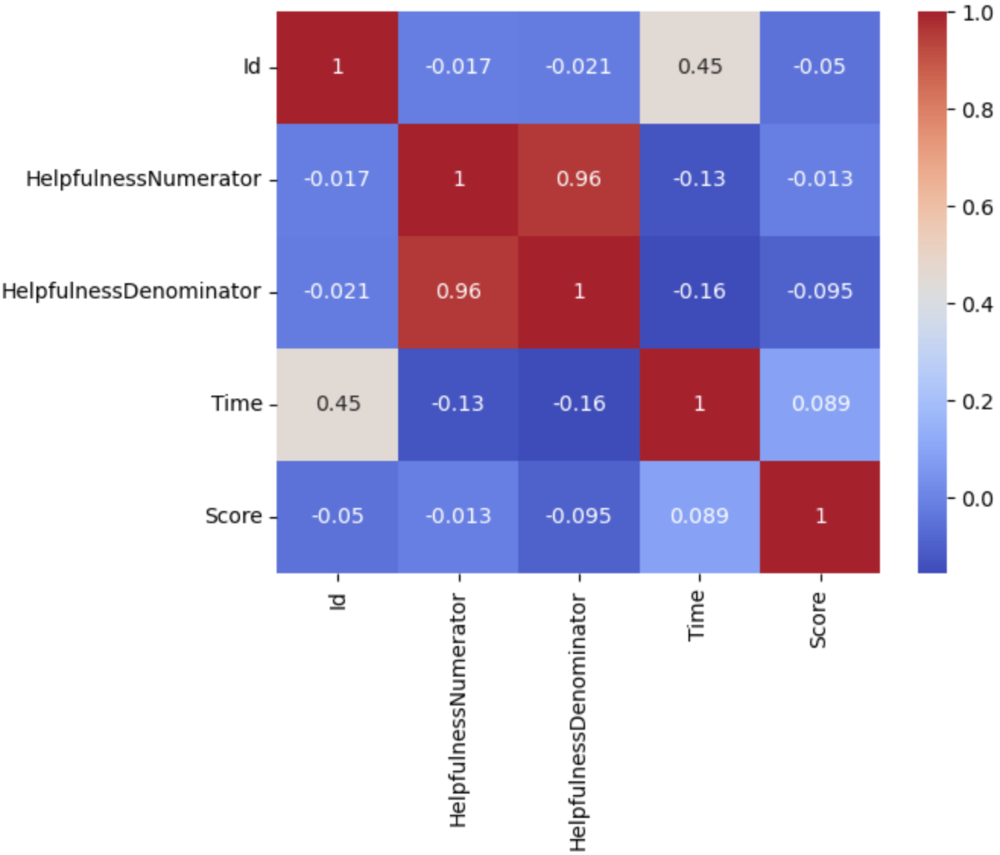
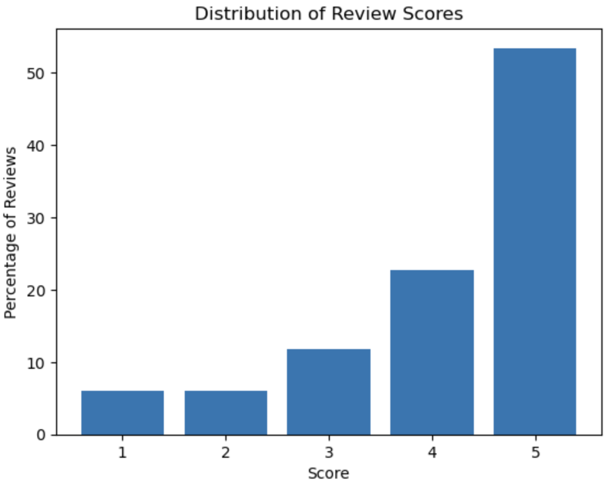
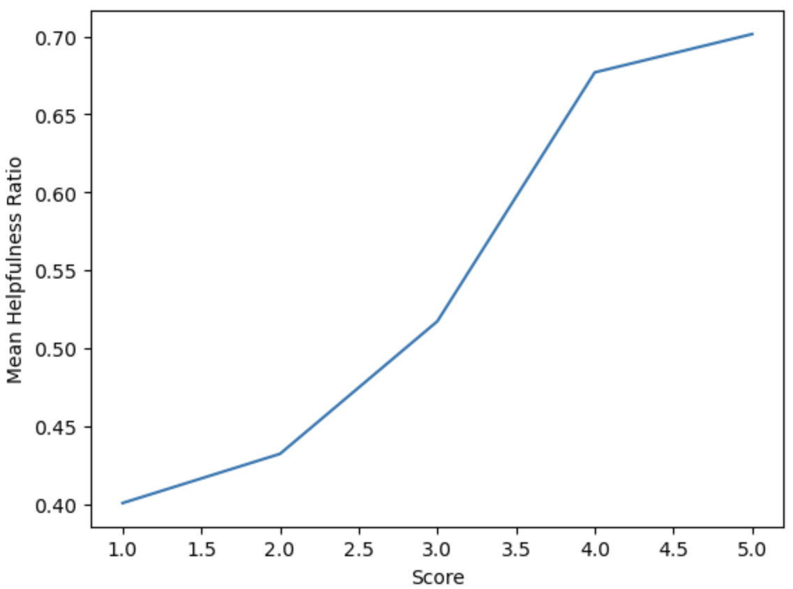
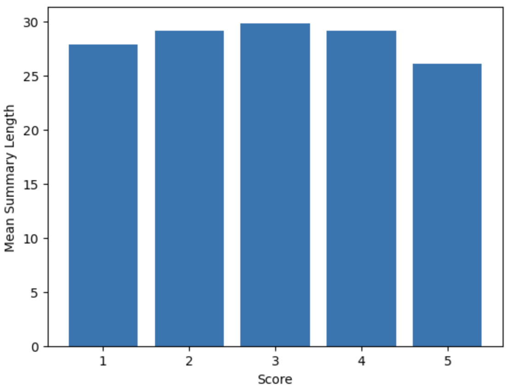
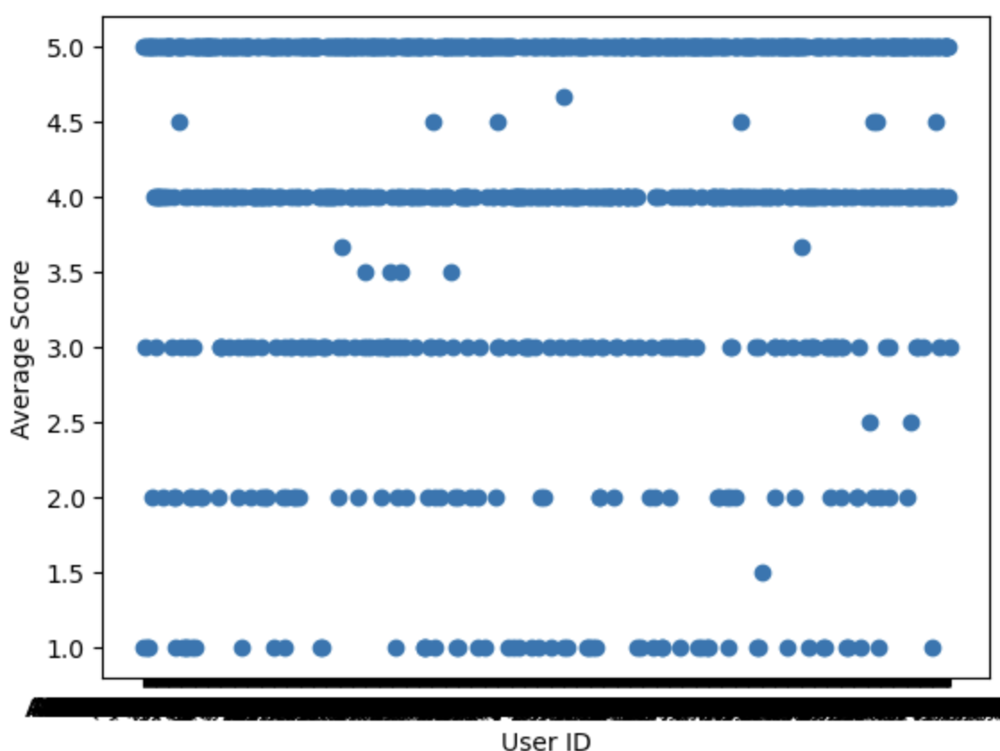
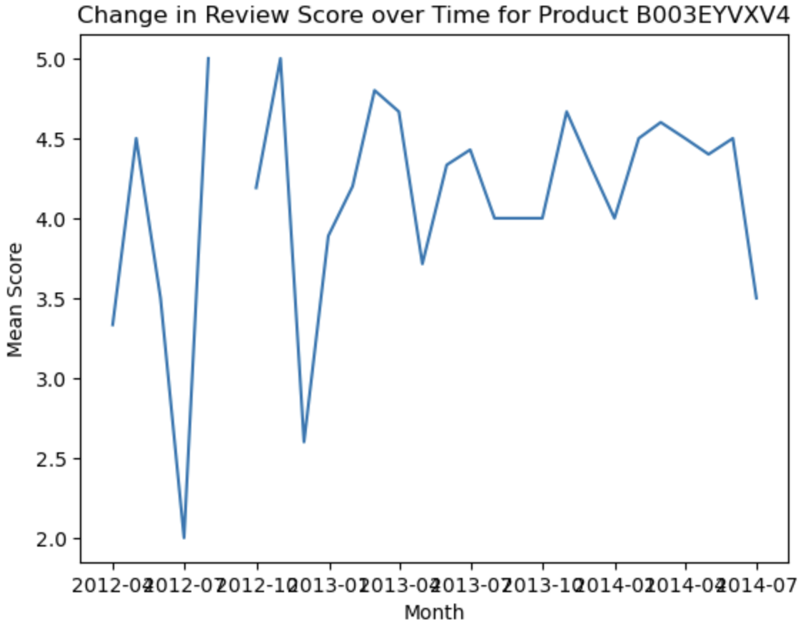
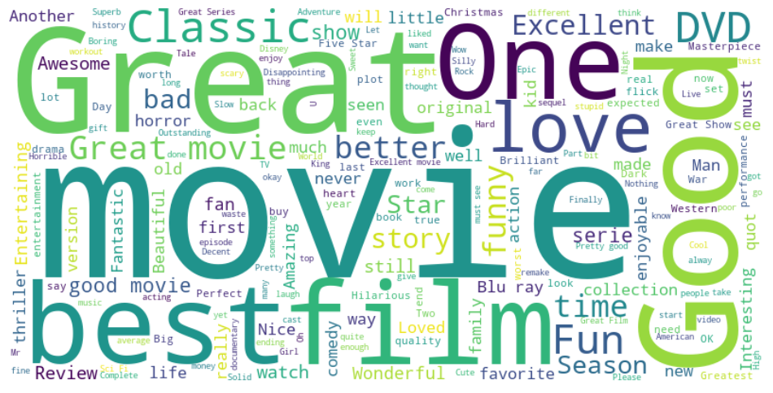
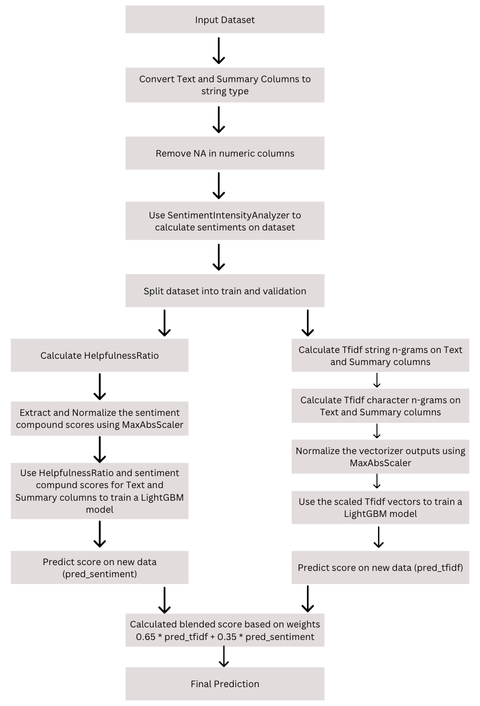

# Kaggle Competition Report

### Showndarya Madhavan[https://www.kaggle.com/showndarya] 28th March 2023

The goal of this competition was to predict the star rating (score) associated with user reviews from Amazon
Movie/product Reviews using the available features - ’Id’, ’ProductId’, ’UserId’, ’HelpfulnessNumerator’,
’HelpfulnessDenominator’, ’Time’, ’Summary’, ’Text’, ’Score’

## 1 Preliminary Analysis:

The following major steps I followed to understand the data provided:

1. Understood the numeric data columns from the basic plots provided in the starter code.
2. Plotted the correlation matrix with the helpfulness values and time to check how related they were with the
    score. (Figure 1)
3. Plotted the distribution of review scores which showed that the data is imbalanced with over 80% of the data
    having scores 4 and 5. (Figure 2)
4. Plotted the HelpfulnessRatio with Score which showed that the ratio is a constantly increasing curve with the
    Score which I considered to be a great feature to use for predictions. (Figure 3)
5. Plotted the mean summary length against the score which helped me conclude that the summary and text
    review lengths have no correlation with the score (Figure 4)
6. Plotted the Average score per UserId which showed no relation between the UserId and the score. (Figure 5)
7. Plotted the change of review score for a ProductId over time on multiple products which showed no clear
    insights on how the ProductId or Time affects the score. (Figure 6)

Correlation matrix            |  Distribution of Review            |  Mean Helpfulness Ratio
:-------------------------:|:-------------------------:|:-------------------------:
  |   |  
Mean Summary Length          | Average Score per UserId          | Review Score Change over Time for Product
  |   |  

## 2 Dataset understanding:

From the above plots and the word cloud below (Figure 7), I understood that

1. The dataset mostly deals with movie reviews in Amazon.
2. Looking at the distribution of scores, we can see a trend of how most users either rate 4 or 5 stars.
3. Initial look at the word cloud gives us an idea that most of the reviews are probably positive or leaning
    towards positive.
4. Looking at the helpfulness ratio, we can see a very clear trend of how people rate products which are helpful
    with higher stars, which is also intuition, but the dataset confirms it.

## 3 Experiment Setup:

Model:
From figure 2, I concluded that thedata is imbalanced, as we see almost 80 % of the dataset has reviews with
scores of either 4 or 5. This made to choose theboosting algorithmslike LightGBM, Adaboost, XGBoost, as
they are designed to train a series of weak learners on the dataset iteratively, so misclassified samples or samples
with higher error rates in one iteration are given more weight which is used as the updated dataset by the next
weak learner.

Figure 7: Word cloud for Sumary Column

### Text Pre-processing:
For correlating the Summary and Text columns with the score, reducing the sentences to just a collection of characters/words is important to make a more meaningful analysis by reducing the noise. I plotted the word cloud of the word
used in Summary first to better understand the words. (Figure 7) After looking at the word cloud, I used TfidfVectorizer to extract the commonly occurring words which differentiate
samples from each other, meanwhile paying less attention to words that frequently occur across most samples. I chose to retain the stop wordsas words likebut, no, good, great defnitely makes a difference in determining the  final scores.
As the output of Tfidf is very sparse, I usedMaxAbsScalertonormalizethe features, as it preserves the sparsity, reducing computational time
### Feature Pre-processing:
From Figure 3, I concluded that, although HelpfulnessNumerator and HelpfulnessDenominator have huge correlation to the review score, theHelpfulnessRatiodefinitely has a significant impact on the score, as we see that theHelpfulnessRatiovalue keeps increasing with the score.
### Hyper-parameter tuning:
I tried applying GridSearchCV for finding the best possible hyperparameters for every model but I couldn’t achieve
that because the kernel kept crashing. So, I resorted to reading the documentation to understand the purpose of
every parameter to figure out whether to change the default value or not. For instance, for LightGBM, I changed the numleavesvalue from 31 to 30 andlearningratefrom 0.05 to 0.06, although compromises on the training speed/time, gives better accurate models according to the documentation.

## 4 Experiments:

Figure 8: Pipeline design followed for best sub-
mission

### Iteration 1: ( Model selection )
To narrow down to the best working model
for the task, I focused on creating asimplified version of
my envisioned pipelineand run it against all the different
boosting algorithms. The steps of the simplified pipeline were:
Extract tfidf character and word n-grams for both Text and
Summary columns - normalize the values using MaxAbsScaler

- use this as the features to train. The models I tried are:
    1. XGBoost
    2. LightGBM
    3. ElasticNet
    4. AdaBoost
    5. StackingEnsemble
    6. VotingEnsemble

The models I tried are:

1. MaxAbsScaler
2. StandardScaler
3. SMOTE
4. MinMaxScaler

### Results Validation:
UsingRMSEscores, I figured out thatLightGBM
worked better than other models withMaxAbsScaler
### Iteration 2 ( Best submission ):
For the actual pipeline which produced my best submission,
refer toFigure 8 for the design. The columns
from the input dataset I utilized are: HelpfulnessNumerator,
HelpfulnesssDenominator, Summary, Text, ProductId

## 5 Challenges:

1. Compute was a major issue as a lot of
    models/pipelines kept crashing. Due to the same reason
    I could only train my models on a fraction of the dataset.
2. As there were a plethora of techniques and models at our
    disposal, i definitely spent a lot of time trying to figure
    out if what I am planning on using is relevant to the
    problem and if it makes sense logically as a solution,
    irrespective of its performance.

